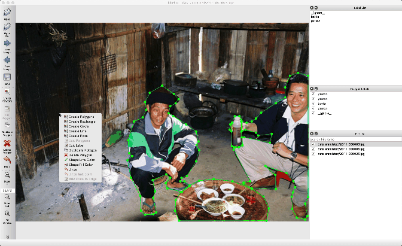

<h1 align="center">
  togif
</h1>

<h4 align="center">
  Command Line Tool to Convert a Video to GIF.
</h4>

<div align="center">
  
</div>


## Installation

```bash
pip install git+https://github.com/wkentaro/togif.git
```


## Usage

```bash
$ togif --help
usage: togif [-h] [--fps FPS] [--speed SPEED] [--duration DURATION]
             [--resize RESIZE]
             input_file

positional arguments:
  input_file           input video

optional arguments:
  -h, --help           show this help message and exit
  --fps FPS            fps (default: 1)
  --speed SPEED        speed (default: 1)
  --duration DURATION  duration (default: None)
  --resize RESIZE      resize (default: 1)
```


## Example

```bash
togif data/2018-11-02_14-44-14.mp4 --resize 0.2 --speed 12
```


